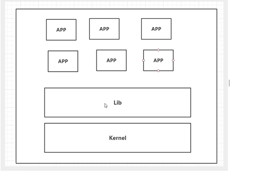
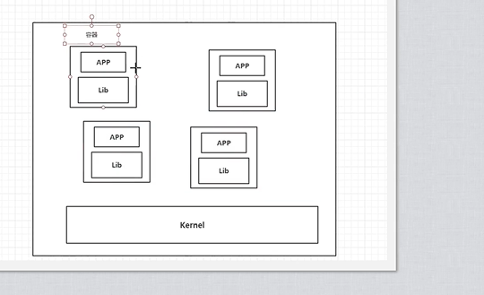
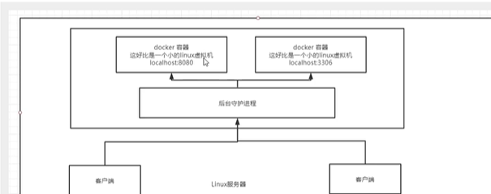

## docker学习笔记

[toc]

### docker&&虚拟机区别：

> 
>
> 
>
> 

### 相关名词

> 镜像：
>
> > 镜像运行后形成容器实例

> 容器：
>
> > 独立运行的一组或者一个应用
> >
> > 类似一个小型的操作系统

> 仓库：存放镜像

### 底层原理

> docker 是cs进程，docker的守护进程运行在后台主机上，通过socket客户端访问主机

## docker 命令

> `docker info`
>
> `systemctl start docker`开启docker
>
> `systemctl stop docker`

### docker 镜像命令

> `docker images a`
>
> `docker images q` 只显示id
>
> `docker search xxx`
>
> `docker search mysql --filter=stars=3000`
>
> `docker pull xxx` 下载
>
> 指定版本下载：
>
> ` dock pull mysql:5.7`
>
> `docker rmi xxx`
>
> `docker rmi -f id1 id2`
>
> 删除全部的images：
>
> `docker rmi -f  $(docker images -aq)`
>
> 

### docker容器的命令

> ***docker run***
>
> > `docker run --name="别名"`
> >
> > `docker run -d `后台运行
> >
> > > 容器停止原因：后台运行必须要有前台进程 docker发现无应用则自动停止
> >
> > `docker run -it`交互模式
> >
> > 
> >
> > 退出：exit
> >
> > `docker run -p 端口`
> >
> > > -p 主机端口：容器端口
> > >
> > > -p 容器端口
> > >
> > > -p ip:主机端口：容器端口
> >
> > `docker run -P`随机端口
>
> 
>
> > `docker ps`
> >
> > > -a 列出正在运行以及历史运行的容器
> > >
> > > -n  num 显示最近创建的容器
> > >
> > > -q 只显示编号
>
> 
>
> > 退出容器：
> > `exit` 退出并停止
> >
> > `ctrl p q`不停止退出
>
> 
>
> > 删除容器：
> >
> > `docker rm id`
> >
> > `docker rm -f $(docker ps -aq)`删除所有
> >
> > `docker ps -a -q |xargs docker rm`
>
> 
>
> > 启动和停止：
> >
> > `docker start id`
> >
> > `docker restart id`
> >
> > `docker sotp id`
> >
> > `docker kill id`
>
> 
>
> > 查看日志：
> >
> > `docker logs`
> >
> > 
> >
> > 
>
> > r容器中进程的信息
> >
> > `docker top 容器id`
>
> f
>
> > 进入容器：
> >
> > `docker exec -it 容器id` 
> >
> > 进入容器正在执行的终端
> >
> > `docker attach 容器id`
> >
> > 
>
> > 从容器拷贝到主机上
> >
> > `docker cp 030af310d1f2:/home/test.js /home`
>
> 
>
> f
>
> f
>
> f

### portalner

> 可视化后台面板

### 联合文件系统

> 分层下载：

### commit

> `docker commit -a='ly' -m="xxx"  容器id  name:版本`

### 数据卷挂载

> `docker run -d -p 3310:3306 -v /home/mysql/conf:/etc/mysql/conf.d -v /home/mysql/data:/var/lib/mysql -e MYSQL_ROOT_PASSWORD=123 --name=mysql1 mysql`
>
> #### 匿名挂载
>
> 
>
> #### 具名挂载(推荐)
>
> > `docker rum -d -p --name nginx02 -v luoyu:/etc/nginx nginx`
> >
> > 位置：`/var/lib/docker/`

