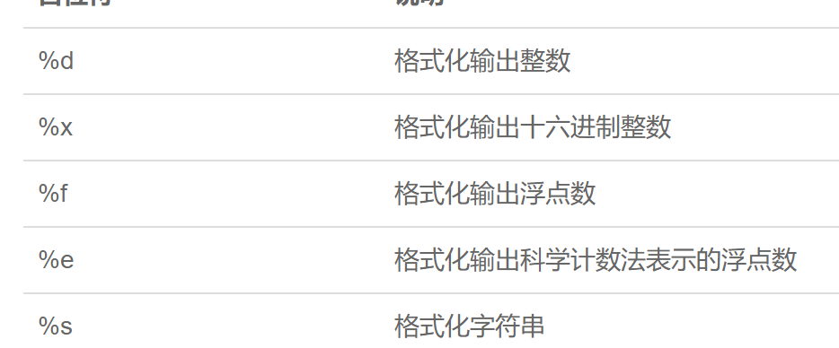

# java笔记

---

[toc]

### 数据类型


>
>
>float 类型定义需要在后面加f：`float x =  3.14f`
>
>char类型用`''` 字符串类型用`""`
>
>==常量的定义==
>
>> `final double PI = 3.14`
>>
>> 定义后不可改变
>
>***var关键字***
>
>> 类型太长可以省略,利用var代替,编译器自动识别.例如对象

#### 变量的作用域

> java中利用`{}`包裹起来的控制语句 在其中***定义*** 的变量在块结束的时候结束.
>
> ```java
> {
>     ...
>     int i = 0; // 变量i从这里开始定义
>     ...
>     {
>         ...
>         int x = 1; // 变量x从这里开始定义
>         ...
>         {
>             ...
>             String s = "hello"; // 变量s从这里开始定义
>             ...
>         } // 变量s作用域到此结束
>         ...
>         // 注意，这是一个新的变量s，它和上面的变量同名，
>         // 但是因为作用域不同，它们是两个不同的变量:
>         String s = "hi";
>         ...
>     } // 变量x和s作用域到此结束
>     ...
> } // 变量i作用域到此结束
> ```
>
> 

***自增和自减***

> `++n`表示先加一在用n;`n++`表示先用n再加一

***强制类型转化***

> `short s  = (int) i ;`

#### 布尔类型运算

> - 比较运算符：`>`，`>=`，`<`，`<=`，`==`，`!=`
> - 与运算 `&&`
> - 或运算 `||`
> - 非运算 `!`

#### 三元运算符

> `b ? x:y`

#### 字符串

> ***字符串连接***
>
> `"Hellow"+"world"`
>
> 对于其他数据类型会自动转化为字符串

> ***多行字符串***
>
> `String s = """
>
> hello
>
> world"""`
>
> ```java
> public class Main {
>     public static void main(String[] args) {
>         String s = "hello";
>         String t = s;
>         s = "world";
>         System.out.println(t); // t是"hello"
>     }
> }
> 
> ```
>
> 因为初始s指向的是hello所在内村空间,s赋值给t的指向也是hello所在的位置

### 数组

---

***java数组特点***

> * 初始为默认值,整数都是***0***,浮点数是***0.0***,布尔数值是***false***
> * 数组创建后大小不可变

***数组定义***

> `int[] ns = new int[5]`
>
> ` int[] ns = {1,2,3,5};`
>
> 字符串是引用类型：

### 输入输出

> `println:print line`:输出并换行
>
> `pirnt`:输出不换行

#### 格式化输出

> ```java
> public class Main {
>     public static void main(String[] args) {
>         double d = 3.1415926;
>         System.out.printf("%.2f\n", d); // 显示两位小数3.14
>         System.out.printf("%.4f\n", d); // 显示4位小数3.1416
>         int n = 12345000;
>         System.out.printf("n=%d, hex=%08x", n, n); //格式化n并输出8位并用0补位的16进制
>     }
> }
> ```
>
> 
>
> 

#### 输入

> ```java
> import java.util.*;
> public class first{
>     public static void main(String[] args) {
>         Scanner scanner = new Scanner(System.in);
>         System.out.print("input your name:");
>         String name =  scanner.nextLine();
>         System.out.print("input your age:");
>         int age = scanner.nextInt();
>         System.out.printf("your name is %s,your age is %d",name,age);
> 
>     }
> 
> }
> ```

### 流程控制

#### if

> 对于引用类型的比较要用
>
> ```java
> public class Main {
>     public static void main(String[] args) {
>         String s1 = "hello";
>         String s2 = "HELLO".toLowerCase();
>         System.out.println(s1);
>         System.out.println(s2);
>         if (s1.equals(s2)) { //字符串是引用类型
>             System.out.println("s1 equals s2");
>         } else {
>             System.out.println("s1 not equals s2");
>         }
>     }
> }
> 
> ```
>
> 

#### switch

>```java
>    public static void main(String[] args) {
>        String s = "test";
>        switch(s){
>            case "test":
>                System.out.println("yes");
>                break;
>            case "sss":
>                System.out.println("llll");
>                break;
>            default :
>                System.out.println("lslls");
>                break;
>
>            case "test" -> System.out.println("java新的switch");
>
>        }
>        int opt = switch (test) {
>            case "test" -> 1;
>            case "sss" ->{
>                string x = "返回负责的表达式用yield";
>                yield x;
>            }
>            default -> 2;//执行赋值操作
>
>
>        }
>
>    }
>
>}
>```
>
>

#### 循环

> ***foreach***
>
> > ```java
> >     public static void main(String[] args) {
> >         int[] s = {1,2,3,6,5};
> >         for (int i : s) {
> >             System.out.println(i);
> >         }
> > 
> >     }
> > 
> > ```