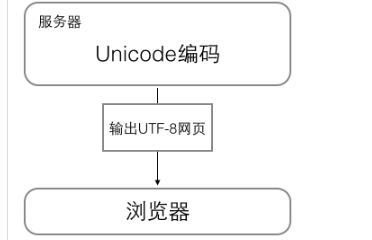
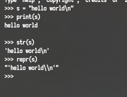

# python深入学习

---

[toc]


- [ ] 学习30分钟

### python基础

----

#### 数据类型变量

==不转义字符`print(r"i am \\ ok ")`==

```python
ord()//获取字符的整数
chr()//编码变字符
//由于Python的字符串类型是str，在内存中以Unicode表示，一个字符对应若干个字节。如果要在网络上传输，或者保存到磁盘上，就需要把str变为以字节为单位的bytes
x=b'abc'//每个字符对应一个字节


//str通过编码方式变为bytes
'abc'.encode('ascii')
//中文通过utf—8转为bytes
'中文'.encode('utf-8')


//bytes变为str
b'abc'.decode('ascii')


```

> 在计算机内存中，统一使用Unicode编码，当需要保存到硬盘或者需要传输的时候，就转换为UTF-8编码。




#### 类型转化

> input 输入的是str int转化为整数


#### len()函数

==对于str是计算字符数 对于bytes是计算字节数==


### list

> list的元素数据类型可以不同
>
> list=['jskdjfkd','sjfdkjfkd]

```pyton
//添加元素
list.append('test')
//添加元素到指定的位置
list.insert(1,'test')
//删除末尾的元素
list.pop()
//删除指定位置的元素
list.pop(i)

```

==高效创建元素==

```pyton
print([i for i in range(1,11,2)])//1,3,5..
```

#### 切片

```pyton
//取前三个元素
list[0:3]//从0开始到3 不包括3
//索引是0可以省略
list[:3]
//从倒数第二个开始取
list[-2:]//倒数第一个是-1
//取前10个数 美两个取一个
List[:10:2]
```

> tuble和字符串都可以切片操作

### tuple

> 一旦初始化就不能改变

==只有一个元素的元组定义的时候为了歧义必须加逗号==

`t=(1,)`

### 条件判断

```python
if:
    
    else:
elif:// else if的缩写
```

### 循环

==for..in循环==

`for i in test:`

#### range函数

> range(101) //0到100的整数序列

==while循环==

### dict

> k-v结构数据

==判读key是否存在==

1. `key in dict`
2. `dict.get(key)`

==删除key的同时value也同时删除==

`dict.pop(key)`


#### list和dict的区别

>和list比较，dict有以下几个特点：
>
>1. 查找和插入的速度极快，不会随着key的增加而变慢；
>2. 需要占用大量的内存，内存浪费多。
>
>而list相反：
>
>1. 查找和插入的时间随着元素的增加而增加；
>2. 占用空间小，浪费内存很少。
>
>所以，dict是用空间来换取时间的一种方法

### set

>set和dict类似，也是一组key的集合，但不存储value。由于key不能重复，所以，在set中，没有重复的key。
>
>要创建一个set，需要提供一个list作为输入集合
>
>

==添加元素==

`add(key)`

==删除元素==

`remove(key)`

### 可变对象和不可变对象

> set和dict中的key必须为不可变对象
>
> list是可变对象

### 函数

==必须有返回值 当无需返回时候直接`return`==

#### 数据类型检查函数 isinstance

```pyton
def my_abs(x):
    if not isinstance(x, (int, float)):
        raise TypeError('bad operand type')
    if x >= 0:
        return x
    else:
        return -x

```

==返回多个值==

> 实际上返回多个值得时候是返回一个tuble

#### 函数参数

==默认参数==

```python
def power(x, n=2):
    s = 1
    while n > 0:
        n = n - 1
        s = s * x
    return s
```

==默认参数必须是不变对象==

#### 可变参数

```python
def calc(*numbers):
    sum = 0
    for n in numbers:
        sum = sum + n * n
    return sum
```

==numbers接受到的是一个tubles,可以传入任意多个参数==

==list和tubles作为参数传递==

> Python允许你在list或tuple前面加一个`*`号，把list或tuple的元素变成可变参数传进去：
>
> 

```
nums = [1, 2, 3]
calc(*nums)
14
```

#### 关键字参数

> 可变参数允许你传入0个或任意个参数，这些可变参数在函数调用时自动组装为一个tuple。而关键字参数允许你传入0个或任意个含参数名的参数，这些关键字参数在函数内部自动组装为一个dict
>
> 

```python
def person(name, age, **kw):
    print('name:', name, 'age:', age, 'other:', kw)


>>> extra = {'city': 'Beijing', 'job': 'Engineer'}
>>> person('Jack', 24, city=extra['city'], job=extra['job'])
name: Jack age: 24 other: {'city': 'Beijing', 'job': 'Engineer'}
            
 //简化

>> extra = {'city': 'Beijing', 'job': 'Engineer'}
>>> person('Jack', 24, **extra)
name: Jack age: 24 other: {'city': 'Beijing', 'job': 'Engineer'}
```

### 递归函数

#### 尾递归

> 函数返回时候调用自己,并且***return语句不能有表达式***
>
> 

### 迭代

### 字典迭代

```python
//默认迭代key
for i in dict:
//迭代value
for i in d.values():
//迭代key和value
for i,j in d.items():
```

### 列表生成式子

> 可以加if 多层循环 

`[s.lower() for s in L]`

`[x for x in range(1, 11) if x % 2 == 0]`

```pyton
[x if x % 2 == 0 else -x for x in range(1, 11)]

L = ['Hello', 'World', 18, 'Apple', None]
L2 = [x.lower() if isinstance(x,str) else x for x in L]
print(L2)
```

### 生成器

==列表生成式构建生成器==

```python
g = (i for i in range(1,10))
for i in range(1,10):
    if (i==9):
        break
    else:
        print(next(g))
for n in g:
    print(n)
```

==关键词构建yield==

> 如果一个函数定义中包含`yield`关键字，那么这个函数就不再是一个普通函数，而是一个generator：
>
> ，在执行过程中，遇到`yield`就中断，下次又继续执行
>
> 

```python
# 构建杨辉三角
def fun(n):
    s=[1]
    m=0
    while m<n:
        yield s
        s=[1]+[s[i]+s[i+1] for i in range(len(s)-1)]+[1]
        m+=1

test = fun(10)
for i in test:
    print(i)
```

==判断是否是可迭代对象==

`isinstance([], Iterable)`

### 迭代器

>可以被`next()`函数调用并不断返回下一个值的对象称为迭代器：`Iterator`。
>
>`Iterator`对象表示的是一个数据流这个数据流看做是一个有序序列，但我们却不能提前知道序列的长度，只能不断通过`next()`函数实现按需计算下一个数据，所以`Iterator`的计算是惰性的，只有在需要返回下一个数据时它才会计算。

==***判断是否是迭代器***==

` isinstance(iter([]), Iterator)`

___

### 高阶函数

>既然变量可以指向函数，函数的参数能接收变量，那么一个函数就可以接收另一个函数作为参数，这种函数就称之为高阶函数

#### map函数

> `map()`传入的第一个参数是`f`，即函数对象本身。由于结果`r`是一个`Iterator`，`Iterator`是惰性序列
>
> ***list()转化为list***

`list(map(str, [1, 2, 3, 4, 5, 6, 7, 8, 9]))`

```python
#map实现名字开头大写
l = ['adam', 'LISA', 'barT']
def f(x):
    return(x[1].upper()+x[1:].lower())
print(list(map(f,l)))
```


#### reduce

> `reduce`把一个函数作用在一个序列`[x1, x2, x3, ...]`上，这个函数必须接收两个参数，`reduce`把结果继续和序列的下一个元素做累积计算，其效果就是：
>
> ```pyton
> reduce(f, [x1, x2, x3, x4]) = f(f(f(x1, x2), x3), x4)
> ```
>
> 

```python
# 累乘
from functools import reduce
def f(x,y):
    return(x*y)
def prod(l):
    return(reduce(f,l))

print('3 * 5 * 7 * 9 =', prod([3, 5, 7, 9]))
if prod([3, 5, 7, 9]) == 945:
    print('测试成功!')
else:
    print('测试失败!')
```

### 匿名函数：

> 关键字`lambda`表示匿名函数，冒号前面的`x`表示函数参数。
>
> 匿名函数有个限制，就是只能有一个表达式，不用写`return`，返回值就是该表达式的结果

### 装饰器

> 假设我们要增强函数的功能，比如，在函数调用前后自动打印日志，但又不希望修改函数的定义，这种在代码运行期间动态增加功能的方式，称之为“装饰器”（Decorator

```python
from functools import wraps
 
def logit(logfile='out.log'):
    def logging_decorator(func):
        @wraps(func)#保持调用装饰器的基本性质不变
        def wrapped_function(*args, **kwargs):
            log_string = func.__name__ + " was called"
            print(log_string)
            # 打开logfile，并写入内容
            with open(logfile, 'a') as opened_file:
                # 现在将日志打到指定的logfile
                opened_file.write(log_string + '\n')
            return func(*args, **kwargs)
        return wrapped_function
    return logging_decorator #函数返回的不是值而是一个类似指针的地址
 
@logit()
def myfunc1():
    pass
 
myfunc1()
# Output: myfunc1 was called
# 现在一个叫做 out.log 的文件出现了，里面的内容就是上面的字符串
 
@logit(logfile='func2.log')
def myfunc2():
    pass
 
myfunc2()
# Output: myfunc2 was called
# 现在一个叫做 func2.log 的文件出现了，里面的内容就是上面的字符串

```

### 面向对象

---

#### 类和实例

==__init__函数==

> ```
> __init__`方法的第一个参数永远是`self`，表示创建的实例本身，因此，在`__init__`方法内部，就可以把各种属性绑定到`self
> ```

#### 访问限制

> 实例的变量名如果以`__`开头，就变成了一个私有变量（private），只有内部可以访问，外部不能访问
>
> 外部代码来说，没什么变动，但是已经无法从外部访问`实例变量.__name`和`实例变量.__score`了：

> 变量名类似`__xxx__`的，也就是以双下划线开头，并且以双下划线结尾的，是特殊变量，特殊变量是可以直接访问的，不是private变量  ==实例不能访问私有变量和私有方法==

> 以一个下划线开头的实例变量名，比如`_name`，这样允许外部访问 但是不推荐

#### 继承&多态

> 子类可以继承父类的全部功能

==子类的方法重新定义后可以覆盖同名的父类方法==

> 在继承中一个实例的数据类型可以是继承的子类 也阔以是父类 反之则不然

==当基类在另一模块中时==

```python
class DerivedClassName(modname.BaseClassName):
    
  #!/usr/bin/python3
 
#类定义
class people:
    #定义基本属性
    name = ''
    age = 0
    #定义私有属性,私有属性在类外部无法直接进行访问
    __weight = 0
    #定义构造方法
    def __init__(self,n,a,w):
        self.name = n
        self.age = a
        self.__weight = w
    def speak(self):
        print("%s 说: 我 %d 岁。" %(self.name,self.age))
 
#单继承示例
class student(people):
    grade = ''
    def __init__(self,n,a,w,g):
        #调用父类的构函
        people.__init__(self,n,a,w)
        self.grade = g
    #覆写父类的方法
    def speak(self):
        print("%s 说: 我 %d 岁了，我在读 %d 年级"%(self.name,self.age,self.grade))
 
 
 
s = student('ken',10,60,3)
s.speak()  
    


```

#### 多继承

==寻找方法==

> 当使用的方法在子类中没有找到  则从基类从左往右找


#### 类变量

> 类变量可以在实例中共享 也阔以直接通过`class.namw`来访问

#### 方法重写

##### super（）函数

```python
class A:
     def add(self, x):
         y = x+1
         print(y)
class B(A):
    def add(self, x):
        super().add(x)
b = B()
b.add(2)  # 3
```

==重写了子类的`__init--`方法 则要调用父类`__init__`方法时：==

`父类名称.__init__(self,参数1，参数2，...)`

```python
#多重继承
class sample(speaker,student):
    a =''
    def __init__(self,n,a,w,g,t):
        student.__init__(self,n,a,w,g)
        speaker.__init__(self,n,t)
        
        
```


### 命名空间和作用域、

#### global

> 当作用域更小的变量要修改同时修改外部时候使用
>
> ```python
> num = 1
> def fun1():
>  global num  # 需要使用 global 关键字声明
>  print(num) 
>  num = 123
>  print(num)
> fun1()
> print(num)
> ```
>
> 

#### nonlocal

> 函数B嵌套了A 在A内想改相同变量时候使用

### 输入输出

> str():函数返回一个用户易读的表达式
>
> repr():产生一个解释器易读的表达形式。



==输出不换行==

```python
for i in range(1,10):
    print(i,end=" ") //end 关键字
    print(i+1)
    
    
    
 for x in range(1, 11):
...     print('{0:2d} {1:3d} {2:4d}'.format(x, x*x, x*x*x)) #d表示宽度 数字表示占位
```

### 读写文件

> ```python
> open(filename, mode)
> ```
>
> 

#### f.readline()

> f.readline() 会从文件中读取单独的一行。换行符为 '\n'。f.readline() 如果返回一个空字符串, 说明已经已经读取到最后一行。

#### f.readlines()

> f.readlines() 将返回该文件中包含的所有行。
>
> 如果设置可选参数 sizehint, 则读取指定长度的字节, 并且将这些字节按行分割。

==迭代读取文件的每一行==

```python
# 打开一个文件
f = open("/tmp/foo.txt", "r")

for line in f:
    print(line, end='')

# 关闭打开的文件
f.close()
```

### python正则表达式

> 元字符：
>
> `.`除了换行符号的所有的字符
>
> ```python
> import re
> text = '''测试红色
> 测试绿色
> 测试蓝色'''
> p=re.compile(r'.色')
> for one in p.findall(text):#列表
>     print(one) 
> ```
>
> 

> `*`:匹配前面的表达式的任意词
>
> 

> `+`匹配前面表达式至少出现一次

> `{}`指定次数
>
> 
>
> 

### 贪婪模式和非贪婪模式

> `* + ?`都是尽可能多的匹配
>
> 设置为非贪婪模式：
>
> `.+?`

### 元字符转义

> `\` e.g:`\.`
>
> `\d`:匹配数字
>
> `\D`匹配非数字
>
> `\s =[\t\n\r\f\v]`匹配空白符号
>
> `\S=[^\t\n\r\f\v]`
>
> `\w`:数字大小写 下划线包括中文 =[0-9a-zA-Z]
>
> ```python
> import re
> text = '''测试红色
> 测试绿色
> luoyu
> 测试蓝色'''
> p=re.compile(r'\w',re.A)#只匹配英文
> for one in p.findall(text):#列表
>     print(one) 
> ```
>
> `[]`可选[35]可选3 5 [0-9]:数字都可
>
> > `[.]`在其中的`.`就是普通字符
>
> 

### 其实位置和单行 多行模式

> `^`
>
> > 多行模式：匹配每行的开始
> >
> > >
> > >
> > >```python
> > >import re
> > >text = '''111-测试红色-1111
> > >222-测试绿色-2222
> > >333-luoyu-3333
> > >444-测试蓝色-4444'''
> > >p=re.compile(r'^\d+',re.M)
> > >for one in p.findall(text):#列表
> > >    print(one) 
> > >```
> > >
> > >111
> > >222
> > >333
> > >444
> >
> > 单行模式：匹配文本的开头
> >
> > ```python
> > import re
> > text = '''111-测试红色-1111
> > 222-测试绿色-2222
> > 333-luoyu-3333
> > 444-测试蓝色-4444'''
> > p=re.compile(r'^\d+')
> > for one in p.findall(text):#列表
> >     print(one) 
> > ```
> >
> > 111
>
> 文本的结尾：`$`
>
> >
> >
> >多行模式：
> >
> >```python
> >p=re.compile(r'\d+$',re.M)
> >```
> >
> >单行模式：
> >
> >`p=re.compile(*r*'\d+$')`
>
> 
>
> 

### 括号 组选择

>```python
>
>p = re.compile(r'-(\w+)-', re.M)
>for one in p.findall(text):#列表
>    print(one) 
>
>```
>
>
>
>多组情况：
>
>

### split

> `re.split(patche.text)`